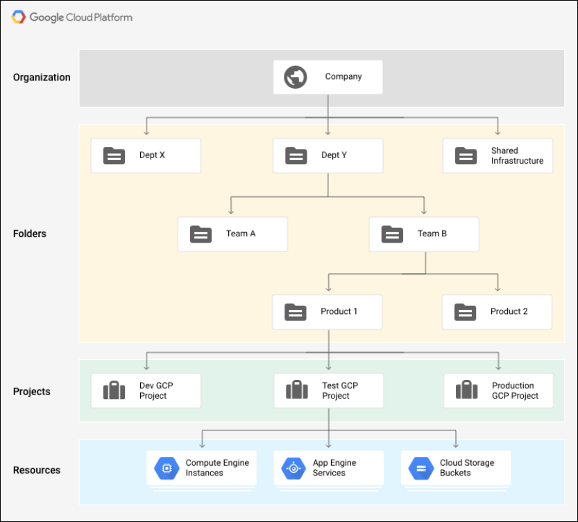

# Google Cloud Network Concepts
[Documentación](https://cloud.google.com/vpc/docs/vpc)
In Google Cloud Platform, networks provide data connections into and out of your cloud resources (mostly Compute Engine instances). Securing your Networks is critical to securing your data and controlling access to your resources.

Google Cloud Platform supports Projects, Networks, and Subnetworks to provide flexible, logical isolation of unrelated resources.

Projects - Networks - Subnetworks window

Projects are the outermost container and are used to group resources that share the same trust boundary. Many developers map Projects to teams since each Project has its own access policy (IAM) and member list. Projects also serve as a collector of billing and quota details reflecting resource consumption. Projects contain Networks which contain Subnetworks, Firewall rules, and Routes (see below architecture diagrams for illustration).

Networks directly connect your resources to each other and to the outside world. Networks, using Firewalls, also house the access policies for incoming and outgoing connections. Networks can be Global (offering horizontal scalability across multiple Regions) or Regional (offering low-latency within a single Region).

Subnetworks allow you to group related resources (Compute Engine instances) into RFC1918 private address spaces. Subnetworks can only be Regional. A subnetwork can be in auto mode or custom mode.

An auto mode network has one subnet per region, each with a predetermined IP range and gateway. These subnets are created automatically when you create the auto mode network, and each subnet has the same name as the overall network.
A custom mode network has no subnets at creation. In order to create an instance in a custom mode network, you must first create a subnetwork in that region and specify its IP range. A custom mode network can have zero, one, or many subnets per region.

for more information on how you can use firewall rules to isolate subnetworks, refer to subnetworks and firewall rules.
https://cloud.google.com/vpc/docs/vpc#vpc_networks_and_subnets
https://cloud.google.com/compute/docs/vpc/firewalls

In general, it is recommended to configure the least permissive firewall rule that will support the kind of traffic you are trying to pass. For example, if you need to allow traffic to reach some instances, but restrict traffic from reaching others, create rules that allow traffic to the intended instances only. This more restrictive configuration is more predictable than a large firewall rule that allows traffic to all of the instances. If you want to have "deny" rules to override certain "allow" rules, you can set priority levels on each rule and the rule with the lowest numbered priority will be evaluated first. Creating large and complex sets of override rules can lead to allowing or blocking traffic that is not intended.

Network route
All networks have routes created automatically to the Internet (default route) and to the IP ranges in the network. The route names are automatically generated and will look different for each project.
## Use Cases
[Documentación](https://cloud.google.com/pubsub/docs/overview#common_use_cases)